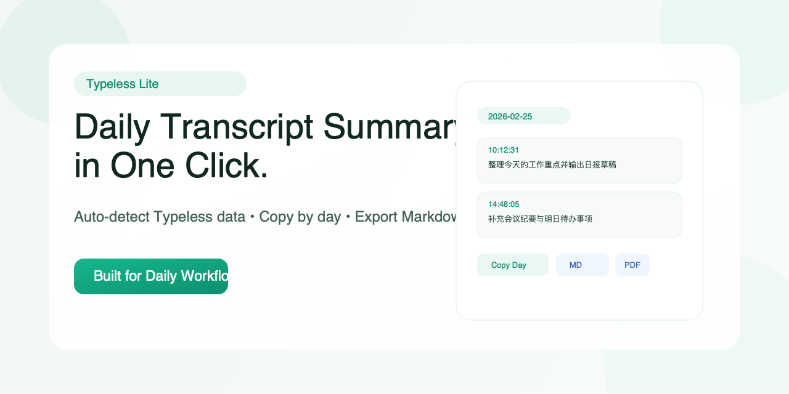

# Typeless Lite

A minimal local desktop app to turn Typeless voice transcripts into daily summaries.


## Download (ZIP)

- Latest release page: `https://github.com/AlexAnys/typeless-lite/releases/tag/v0.1.2`
- Direct ZIP: `https://github.com/AlexAnys/typeless-lite/releases/download/v0.1.2/Typeless-Lite-v0.1.2-macos-arm64.zip`
- Download, unzip, then open `Typeless Lite.app`

## 中文说明

### 这是什么

Typeless Lite 是一个本地桌面工具，自动读取 Typeless 转录内容，按日期整理，支持一键复制和导出。

### 痛点

用语音输入管理工作很高效，但“每天总结”通常很低效：

- 官方暂时没有便捷的按日复制/导出方式。
- 数据在本地，但路径和结构不直观。
- 手动逐条复制容易漏、耗时长。

### 解决方法

Typeless Lite 把流程压缩为 3 步：

1. 自动识别本机 Typeless 数据库（失败时可手动选择）。
2. 自动按日期和时间点组织转录内容。
3. 一键复制当天内容，或导出为 Markdown / PDF / Raw。

### 核心功能

- 自动识别 `typeless.db`
- 日期 + 时间线浏览
- 一键复制“选定日期全部对话”
- 导出 Markdown（编辑友好）
- 导出 PDF（分享友好）
- 导出 Raw（`JSON + typeless.db.backup`）

### 隐私说明

- 全程本地处理，不上传云端。
- 默认只读取你本机的 Typeless 数据。

### 本地打开（开发模式）

```bash
cd "/Users/alexmac/Documents/Mini 项目开发/typeless-lite"
npm install
npm run dev
```

### 本地打开（打包版）

#### 非技术用户：推荐安装方式（ZIP）

1. 打开发布页：`https://github.com/AlexAnys/typeless-lite/releases`
   也可以直接打开：`https://github.com/AlexAnys/typeless-lite/releases/tag/v0.1.2`
2. 找到最新版本，展开 `Assets`
3. 下载：`Typeless-Lite-v0.1.2-macos-arm64.zip`
4. 双击 zip 解压
5. 打开解压后的文件夹，双击 `Typeless Lite.app`

#### 如果 macOS 提示“无法打开”

1. 对 `Typeless Lite.app` 点右键
2. 选择 `打开`
3. 在弹窗里再次点 `打开`（只需要一次）

#### 打开后怎么用（最简）

1. 应用会自动读取 Typeless 数据
2. 左侧选日期，右侧看当天内容
3. 点 `复制当天` 或 `Markdown/PDF/Raw` 导出

### 打包

```bash
npm run dist:mac
```

输出目录：`release/`

### GitHub 社交封面

- 封面文件：`assets/social-preview.png`
- 设置路径：GitHub 仓库 `Settings` -> `General` -> `Social preview` -> `Upload an image`

## English

### What It Is

Typeless Lite is a local desktop app that automatically reads Typeless transcripts, groups them by day, and lets you copy or export in one click.

### The Problem

Voice input is fast, but daily review is not:

- No convenient official daily copy/export flow.
- Data is local, but hard to access directly.
- Manual copy is slow and error-prone.

### The Solution

Typeless Lite reduces the workflow to 3 steps:

1. Auto-detect Typeless database (manual fallback included).
2. Organize transcripts by date and timestamp.
3. Copy a full day instantly, or export as Markdown / PDF / Raw.

### Features

- Auto-detect `typeless.db`
- Date + timeline view
- One-click copy for selected day
- Markdown export
- PDF export
- Raw export (`JSON + typeless.db.backup`)

### Privacy

- 100% local processing.
- No cloud upload by default.

### Run Locally (Dev)

```bash
cd "/Users/alexmac/Documents/Mini 项目开发/typeless-lite"
npm install
npm run dev
```

### Build

```bash
npm run dist:mac
```

Output directory: `release/`

### Install from ZIP (for non-technical users)

1. Open `https://github.com/AlexAnys/typeless-lite/releases`
2. Or open `https://github.com/AlexAnys/typeless-lite/releases/tag/v0.1.2`
3. Download `Typeless-Lite-v0.1.2-macos-arm64.zip` from **Assets**
4. Unzip
5. Double-click `Typeless Lite.app`

If macOS blocks it: right-click app -> **Open** -> **Open**.

### GitHub Social Preview

- Asset: `assets/social-preview.png`
- GitHub path: `Settings` -> `General` -> `Social preview` -> `Upload an image`

## Tech Stack

- Electron
- React + TypeScript
- Vite
- local `sqlite3` CLI
